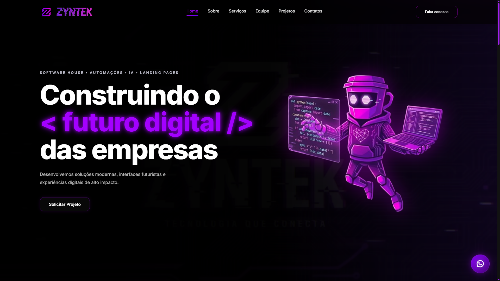

# 🚀 Zyntek Landing Page - Software House & Automações

Bem-vindo ao repositório da landing page oficial da **Zyntek**. Este projeto foi totalmente planejado, desenhado e desenvolvido por mim para servir como o cartão de visitas digital da nossa Software House, unindo uma estética Cyberpunk/Futurista marcante com alta performance.

---

## ✨ Preview do Projeto

---

## ✨ O Projeto

A landing page da Zyntek foi projetada para conectar tecnologia de ponta com negócios visionários. O objetivo principal do site é converter visitantes em clientes reais através de uma navegação fluida, seções institucionais bem definidas e um catálogo interativo de serviços.

### 🎨 Funcionalidades em Destaque:
* **⚡ Efeito Typing Dinâmico:** Uma introdução imersiva com animação de digitação (`Construindo o < futuro digital /> das empresas`) que prende a atenção do usuário logo no primeiro frame.
* **👥 Seção "Mentes por trás da Inovação":** Cards interativos para a equipe de fundadores. Ao clicar, um modal personalizado exibe o arsenal técnico, o portfólio e os canais de contato de cada membro.
* **💼 Catálogo de Soluções Inteligentes:** Apresentação clara de serviços como Landing Pages de alta conversão, Sistemas de Agendamento, Dashboards para Restaurantes e Barbearias, e-Commerces e Integrações com IA.
* **📽️ Galeria de Projetos com Modal de Vídeo:** Visualização detalhada de projetos desenvolvidos pela equipe diretamente na plataforma através de pop-ups interativos.
* **📱 Design Responsivo:** Totalmente otimizado para qualquer tamanho de tela, garantindo uma experiência fluida no Desktop, Tablet ou Mobile.

---

## 🛠️ Arsenal Técnico

O projeto foi construído do zero focando em um código limpo, sem dependências pesadas e com alta velocidade de carregamento:

* **Estrutura & Semântica:** HTML5
* **Estilização & Efeitos:** CSS3 (Variáveis customizadas para gerenciamento do Dark Mode e efeitos Neon)
* **Interatividade & Animações:** JavaScript (Vanilla) para manipulação de modais, scroll suave e lógica de digitação.
* **UI/UX Design:** Prototipado e planejado no Figma.

---

## 👥 A Equipe Zyntek

O site destaca os pilares técnicos e estratégicos da empresa através dos modais interativos:

* **Henrique Hideki** — *COO & Lead Dev | Diretor Jurídico*
* **Levy Andrade** — *COO & CDO | Diretor de Operações, Design & Engenharia de Software*
* **Henrique Soares** — *CTO | Diretor de Tecnologia e Infraestrutura*
* **Zynk AI** — *Núcleo de Inteligência e Automação*

---

## Quer transformar o ecossistema digital da sua empresa ou trocar uma ideia sobre o código? Vamos conversar!

GitHub: @Levy-Andrade

LinkedIn: Levy Andrade

E-mail: levyandrade2109@gmail.com

"Construindo o futuro digital das empresas." 💜

Desenvolvido com 💻 e ☕ por Levy Andrade.